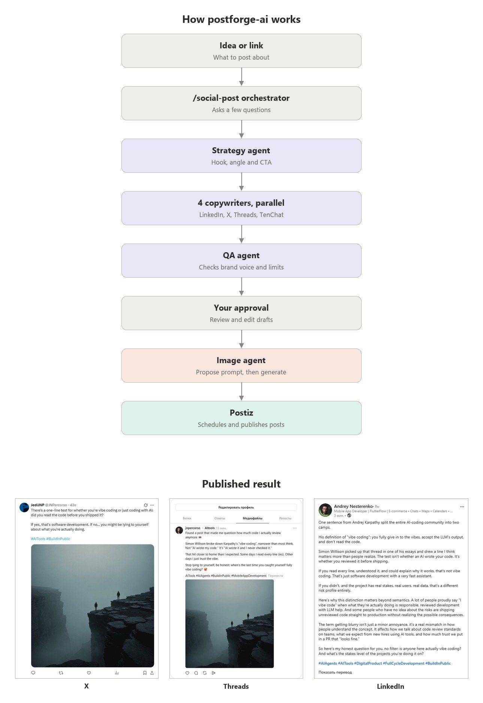

# social-media-content-maker-ai

Автоматизированная система создания и публикации постов для соцсетей на основе сети ИИ-агентов внутри [Claude Code](https://claude.com/claude-code).
Ты описываешь идею или даёшь ссылку — система создаёт готовые посты для всех платформ, показывает на одобрение и (опционально) публикует напрямую.



---

## Быстрый старт

1. Склонируй репозиторий и открой папку в Claude Code (`.claude/skills` и `.claude/agents` подхватятся автоматически)
2. Скопируй `brand.example.md` → `brand.md`, заполни голос бренда, тон, стоп-фразы
3. Скопируй `.env.example` → `.env`, вставь ключ Stability AI (опционально, для генерации изображений)
4. Запусти `/social-post`

Подробности по каждому шагу — в разделе [«Настройка перед первым запуском»](#настройка-перед-первым-запуском) ниже.

---

## Как это работает

```
Ты (идея / ссылка / тема)
        │
        ▼
┌─────────────────────────────────────────────────────┐
│              Оркестратор /social-post               │
│                                                     │
│  ШАГ 1  → Сбор брифа (вопросы к тебе)             │
│  ШАГ 1.5→ Читает источник по ссылке (если есть)   │
│  ШАГ 2  → [Агент стратегии]                        │
│  ШАГ 3  → [4× Агент копирайтинга, параллельно —    │
│           по одному на платформу]                  │
│  ШАГ 4  → [Агент QA]                               │
│  ШАГ 5  → Preview текстов → твоё одобрение         │
│  ШАГ 6  → [Агент изображений] (опционально):       │
│           предлагает промпт → твоё согласование    │
│           → только потом генерация через Stability │
│  ШАГ 7  → Финальный Preview (текст + изображение)  │
│  ШАГ 8  → Архив + готовые блоки для копипаста      │
│  ШАГ 9  → Публикация через Postiz (опционально):   │
│           LinkedIn/X/Threads — после твоего        │
│           явного запроса и подтверждения           │
└─────────────────────────────────────────────────────┘
        │
        ▼
  LinkedIn · X/Twitter · Threads (через Postiz)
  TenChat (вручную — нет публичного API)
```

**Ключевой принцип:** ты утверждаешь результат перед публикацией. Ничего не публикуется автоматически — даже при использовании Postiz, каждый реальный вызов публикации требует твоего явного подтверждения.

---

## Запуск

```
/social-post
```

Оркестратор задаст 5–6 вопросов, потом всё сделает сам.

---

## Что можно подать на вход

| Тип входа | Пример |
|-----------|--------|
| Идея своими словами | "Хочу написать о том, как FlutterFlow сэкономил мне 3 недели разработки" |
| Ссылка на статью | "Вот статья про no-code, хочу сделать пост со своим мнением: https://..." |
| Ссылка на чужой пост | "Видел этот пост в LinkedIn, хочу ответить / переосмыслить: https://..." |
| Ссылка на свой проект | "Запустил новый проект, вот сайт: https://..." |
| Несколько источников | URL + свои мысли + что исключить |

Когда дана ссылка — агент **читает источник**, извлекает ключевые идеи и адаптирует их в твой голос. Не пересказывает чужое, а создаёт твою точку зрения на основе материала.

---

## Платформы и языки

| Платформа | Язык | Длина | Стиль |
|-----------|------|-------|-------|
| LinkedIn | English | 150–300 слов | Профессиональный, история + инсайт |
| X / Twitter | English | ≤280 символов | Punch-line, краткость, прямота |
| Threads | English | 150–500 символов | Разговорный, немного личного |
| TenChat | Русский | 500–2000 символов | Деловой, конкретика, кейсы |

---

## Агенты (кто что делает)

### Агент стратегии (`social-strategy`)
Читает бриф и brand.md. Определяет для каждой платформы:
- Hook — первая фраза, которая останавливает скроллинг
- Угол — какую ценность раскрываем
- CTA — призыв к действию (или его отсутствие)
- Хэштеги

### Агент копирайтинга (`social-copywriter`)
Пишет посты по стратегии. Знает требования каждой платформы по длине, тону и формату.
Если дан источник — адаптирует материал в голос бренда, не копирует.
Для англоязычных постов (LinkedIn, X/Twitter, Threads) добавляет в конце русский перевод — только для понимания пользователем, не для публикации (лимиты платформы к переводу не относятся, он нигде не публикуется).

Оркестратор запускает **4 параллельных вызова** этого агента (по одному на платформу) — каждый возвращает готовый текст в ответе и не пишет файл сам, чтобы не было параллельной записи; оркестратор собирает все 4 результата и пишет `post.json` одним разом. Все проверки (длина, тире, шаблонные CTA) идут одним батч-Bash-запуском на платформу, а не по одной строке за раз — это и есть оптимизация скорости, см. историю изменений.

### Агент изображений (`social-image-gen`)
Генерация идёт через **Stable Image Core** (модель на основе SDXL, $0.03/изображение) — быстрая и дешёвая, но с известными ограничениями: ненадёжный рендер текста на картинке, слабое удержание сложных многосубъектных сцен, риск "просочившихся" слов-артефактов если исключения пишутся внутри основного текста промпта. Агент учитывает это: использует нативные поля API `negative_prompt` (исключения отдельно от описания сцены) и `style_preset` (готовый стиль вместо словесного описания), не закладывается на читаемый текст в кадре, держит один чёткий субъект на сцену.

Работает в два прохода, оба запускаются оркестратором только после того, как тексты постов одобрены, и **только оркестратор никогда не придумывает метафору/промпт сам** — это всегда задача агента:
1. **PROPOSE** — извлекает общую суть всех 4 постов, переводит её в конкретную визуальную метафору (не дефолтные IT-клише и не повторяет паттерн из прошлой попытки), осознанно выбирает стиль (реализм — не обязателен, может быть line-art, digital-art, cinematic и т.д. в зависимости от смысла), составляет prompt и negative_prompt раздельно. Изображение пока не генерируется — предложение показывается тебе на согласование.
2. **GENERATE** — только после твоего одобрения вызывает Stability AI API с согласованными prompt/negative_prompt/style_preset и сохраняет PNG в `posts/images/`.

Если API-ключ не установлен — выводит промпт для ручной генерации.

### Агент QA (`social-qa`)
Финальная проверка перед показом тебе:
- Соответствие голосу бренда (нет стоп-фраз, правильный тон)
- Технические требования платформ (лимиты символов, структура)
- Соответствие брифу (всё ли включено, ничего лишнего)
- Если есть замечания — показывает их тебе с предложениями

### Публикация через Postiz (ШАГ 9, опционально)
После сохранения архива оркестратор спрашивает, публиковать ли пост напрямую через [Postiz](https://postiz.com) — LinkedIn, X, Threads. **TenChat не поддерживается** (у платформы нет публичного API, публикация туда всегда вручную, копипастом из архива).

Механика (не агент, оркестратор делает это сам через CLI):
1. Если есть изображение — загружает его в Postiz один раз (`postiz upload`)
2. Для каждой выбранной платформы превращает архивный `post.json` в формат, который реально ожидает Postiz CLI, через `postiz_publish.py`, затем вызывает `postiz posts:create --json <platform>_post.json`
3. Перед каждой реальной публикацией — явное подтверждение пользователя (для X отдельно — предупреждение о платности: $0.015/пост, $0.20 если есть ссылка)
4. Проверяет результат (`postiz posts:list`, `state == "PUBLISHED"`) и дописывает ссылки в архив

Подробности и обязательные технические правила (что ломается и почему) — в [SKILL.md](.claude/skills/social-post/SKILL.md), раздел ШАГ 9.

---

## Настройка перед первым запуском

### 1. Заполни brand.md
Скопируй `brand.example.md` в `brand.md` и заполни:
- Своё имя и роль
- Bio на EN и RU
- Тон для каждой платформы (или оставь стандартный)
- Стоп-фразы, которые не хочешь видеть в постах
- 2–3 примера своих лучших постов (агенты ориентируются на них)

`brand.md` — личный файл, в `.gitignore`, не публикуется. Без него агенты будут угадывать твой голос.

### 2. Заполни .env
Открой `.env` и вставь свои ключи:

```env
STABILITY_API_KEY=sk-...   # stability.ai → Account → API Keys
```

**Правила .env:**
- Все API-ключи проекта хранятся только здесь
- Никогда не коммитить `.env` в git — добавь в `.gitignore`
- `.env.example` — шаблон без реальных значений, его коммитить можно и нужно

Без ключа Stability AI система работает, просто без автогенерации изображений.

### 3. Подключи Postiz (для публикации, опционально)

Без этого шага система работает как раньше — просто без ШАГ 9, только архив и копипаст-блоки.

1. Зарегистрируйся на [postiz.com](https://postiz.com), подключи нужные аккаунты (LinkedIn/X/Threads) через веб-интерфейс
2. Установи CLI локально (скилл `.claude/skills/postiz` уже в репозитории, нужен только сам npm-пакет):
   ```
   npm install postiz
   npx postiz auth:login
   ```
3. Узнай ID подключённых аккаунтов и впиши их в `postiz_integrations.json` (создать самостоятельно, в `.gitignore` — он не публикуется, так как ID привязаны к твоему аккаунту):
   ```
   npx postiz integrations:list
   ```

---

## Структура файлов

```
social-media-content-maker-ai/
├── README.md                  ← этот файл (обновлять при изменениях системы)
├── brand.example.md            ← шаблон голоса бренда (коммитится)
├── brand.md                    ← твой личный голос бренда (НЕ коммитится, скопировать из примера)
├── image_gen.py                ← скрипт генерации изображений (Stability AI)
├── postiz_publish.py           ← адаптер: архивный post.json → формат, который реально ожидает Postiz CLI
├── postiz_integrations.json    ← маппинг platform → Postiz integration ID (создать самостоятельно, не коммитится)
├── package.json                 ← зависимость postiz (npm install postiz)
├── .env                        ← все API-ключи (НЕ коммитить)
├── .env.example                ← шаблон ключей без значений (коммитить)
├── temp/                       ← рабочий файл оркестратора post.json (создаётся автоматически, не коммитится)
├── posts/
│   ├── YYYY-MM-DD_slug.md      ← человекочитаемый архив (копипаст-блоки + ссылки на опубликованное)
│   ├── YYYY-MM-DD_slug.json    ← структурированный архив (то же содержимое + ключ publish после ШАГ 9)
│   └── images/
│       └── YYYY-MM-DD_slug.png
└── .claude/
    ├── skills/
    │   ├── social-post/SKILL.md    ← оркестратор (точка входа)
    │   └── postiz/SKILL.md          ← документация Postiz CLI
    └── agents/
        ├── social-strategy.md       ← агент стратегии
        ├── social-copywriter.md     ← агент копирайтинга
        ├── social-image-gen.md      ← агент изображений
        └── social-qa.md             ← агент QA
```

Все агенты читают и дописывают разные ключи одного и того же `post.json` (живёт в `temp/` во время прогона). Между стадиями пайплайн строго последовательный; внутри стадии копирайтинга 4 агента (по платформе) работают параллельно, но файл не пишут сами — возвращают текст в ответе, и запись в `post.json` делает оркестратор один раз, после того как все вернулись. Так конфликтов записи не возникает. Подробная схема — в [SKILL.md](.claude/skills/social-post/SKILL.md).

---

## Типичный сессия

```
Ты:      /social-post
Система: Задаёт 6 вопросов (тема, источник, тон, изображение...)
Ты:      Отвечаешь
Система: [автоматически] Читает источник → Стратегия → Посты → QA
Система: Показывает превью текстов всех 4 постов
Ты:      "Тексты подходят" (или просишь правки)
Система: Предлагает суть/метафору/промпт для изображения
Ты:      "Промпт подходит" (или просишь поправить деталь/метафору)
Система: Генерирует изображение, показывает финальный превью
Ты:      "Публикуем" или "Измени вот это..."
Система: Даёт готовые блоки для копипаста по каждой платформе
         Сохраняет в posts/YYYY-MM-DD_slug.md и posts/YYYY-MM-DD_slug.json
Система: "Опубликовать сейчас через Postiz? Все платформы или выбрать?"
Ты:      "LinkedIn и X" (или "не публиковать" — тогда только архив)
Система: Подтверждает каждую публикацию отдельно, для X — предупреждает про стоимость
         Публикует, проверяет статус, дописывает ссылки в архив
```

---

## Автопубликация — текущий охват

Через [Postiz](https://postiz.com) (ШАГ 9) реализована публикация в **LinkedIn, X, Threads**. Покрытие платформ ограничено тем, что умеет сам Postiz — он берёт на себя интеграцию с официальными API этих сетей.

**TenChat не покрыт и не будет** — у платформы нет публичного API в принципе (не вопрос инструмента), публикация туда остаётся ручной, копипастом из архива.
